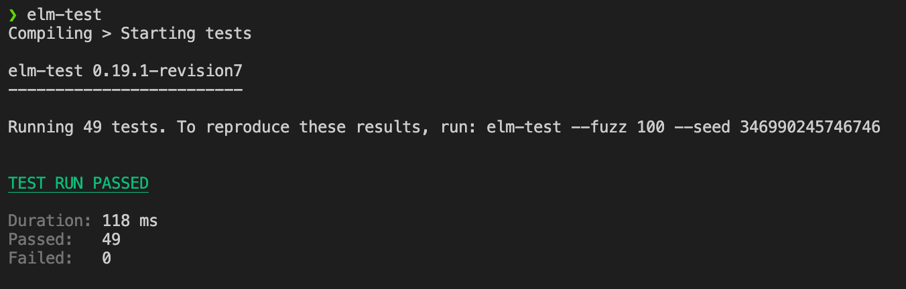

# Caesar Encryption Week 2

## Description
The caesar encryption works by advancing letters by `n` places, with `n` being the key.

### Encryption
When encrypting a character it will be converted to a char code and subsequently to an alphabet index. With the alphabet index being an integer from 0 through 25 representing the letters a through z, the algorithm will then add the encryption key to this index. If the resulting index is greater than 25 it will be wrapped around using the modulo operator. When this is done the index will be converted back into a char code and eventually into a proper char.

### Decryption
The decryption algorithm simply uses the encryption algorithm but with the additive inverse of the key.

## Testing
### Dependencies
Install the `elm-test` npm package globally
```
npm i -g elm-test
```
### Running tests
```
elm-test
```

## Screenshots
### Encrypting

### Decrypting

### Tests


