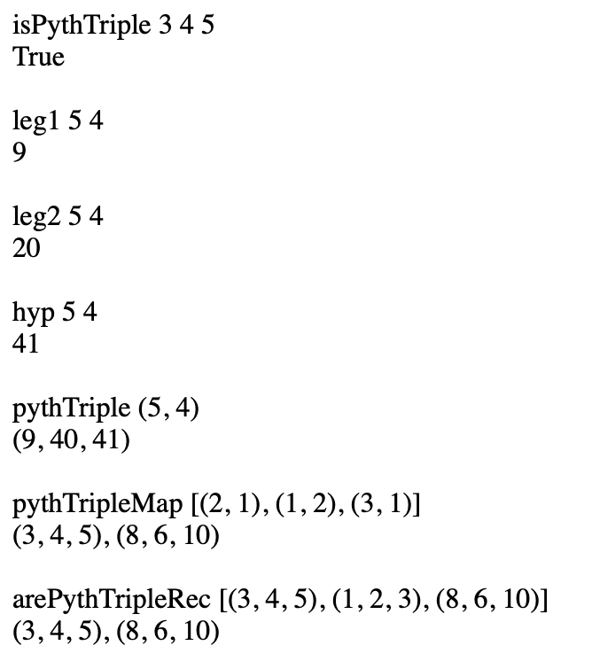
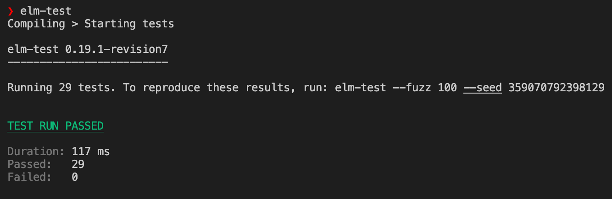

# Pythagoras Triple Week 1

## Testing
### Dependencies
Install the `elm-test` npm package globally
```
npm i -g elm-test
```
### Running tests
```
elm-test
```

## Screenshots
### Output

### Tests


